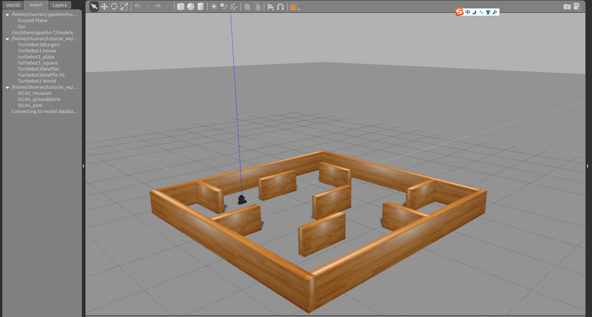
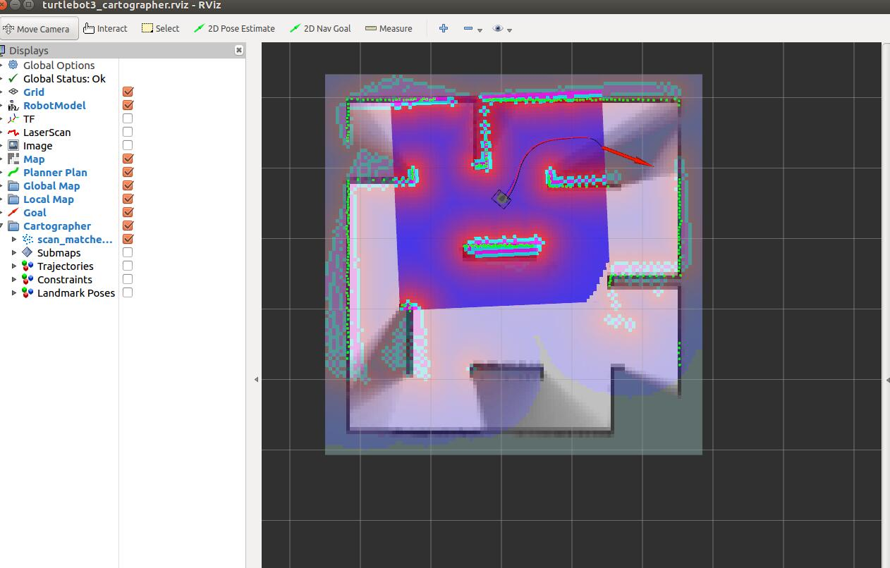
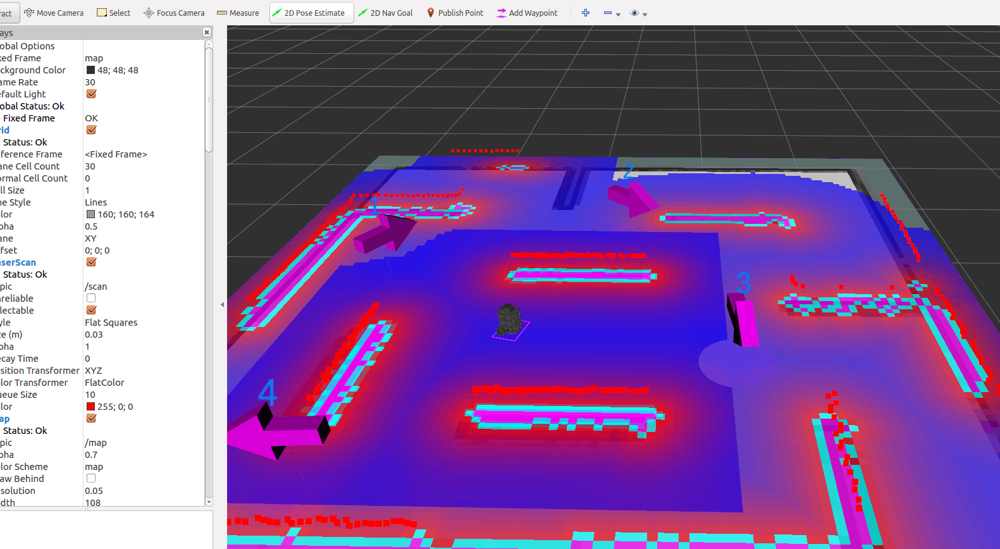
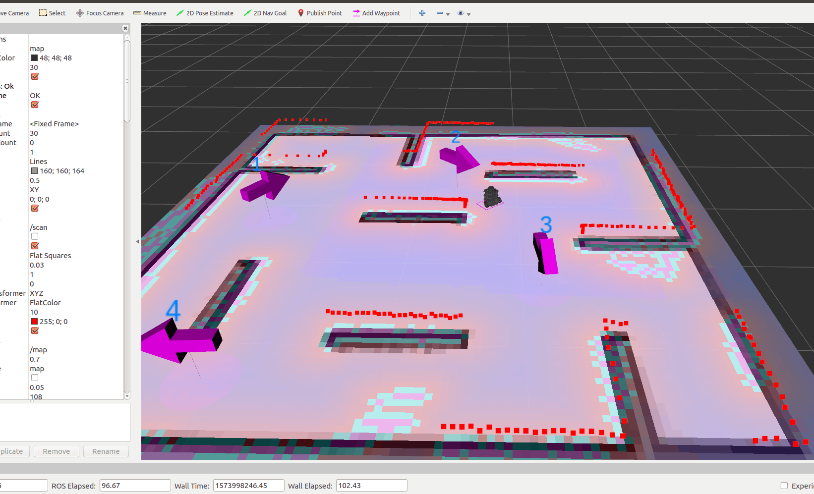

# Cartographer_ICRA仿真
## 使用步骤

1. 配置好[carographer](https://github.com/cartographer-project/cartographer) | [cartographer_ros](https://github.com/cartographer-project/cartographer_ros) |  [cartographer_turtlebot](https://github.com/cartographer-project/cartographer_turtlebot) | [ceres-solve](https://github.com/ceres-solver/ceres-solver).

2. 安装依赖项
```
sudo apt-get install ros-kinetic-joy ros-kinetic-teleop-twist-joy ros-kinetic-teleop-twist-keyboard ros-kinetic-laser-proc ros-kinetic-rgbd-launch ros-kinetic-depthimage-to-laserscan ros-kinetic-rosserial-arduino ros-kinetic-rosserial-python ros-kinetic-rosserial-server ros-kinetic-rosserial-client ros-kinetic-rosserial-msgs ros-kinetic-amcl ros-kinetic-map-server ros-kinetic-move-base ros-kinetic-urdf ros-kinetic-xacro ros-kinetic-compressed-image-transport ros-kinetic-rqt-image-view ros-kinetic-gmapping ros-kinetic-navigation ros-kinetic-interactive-markers
```
3. 获取源码放到工作空间下
```
mkdir -p ~/catkin_ws/src/ && cd ~/catkin_ws/src/
sudo cp ~/Cartographer_ICAR/{turtlebot3,turtlebot3_msgs,turtlebot3_simulations,waterplus_map_tools} ~/catkin_ws/src/
```
4. 编译
```
cd ~/catkin_ws
catkin_make
echo "source ~/catkin_ws/devel/setup.bash" >> ~/.bashrc
echo "export TURTLEBOT3_MODEL=burger" >> ~/.bashrc
```
5. 使用说明

* 为了方便使用我把launch文件合成了shell脚本放在仓库目录的shell_carto文件夹内
* 另附Cartographer源码分析

## 操作方法

### 1. cartographer建图
打开仿真环境
```
cd shell_carto/
./gazebo_empty_start.sh
```

cartographer建图
```
./mapping_cartographer.sh
```

保存地图
```
mkdir ~/map
./savemap.sh
```
### 2. 利用 cartographer纯定位+movebase 进行定点导航
```
./gazebo_empty_start.sh
./carto_localization.sh
```

### 3. 基于2实现多点连续导航
利用Add Waypoint设置多个目标点
```
sudo cp waypoints.xml ~/waypoints.xml
./gazebo_empty_start.sh
./tools_carto_localization.sh
```

保存标注目标点信息到~/waypoints.xml,并依次发送move_base_msgs::MoveBaseGoal goal信息
```
./map_tools.sh
```


